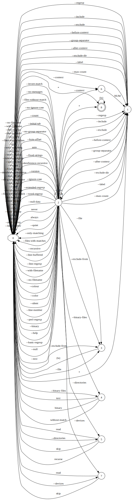

This document is intended to lower the bar for contributing to `complgen`.

# How it works

`complgen` is architected somewhat like a compiler: it has several transformation stages and data flows only
in one direction like in a pipeline.

The stages are as follows:

1. Parse a `.usage` file into a Rust data structure
1. Convert the data structure into a regular expression (in the textbook sense, not in the programmar sense)
1. Convert the regular expression into a Deterministic Finite Automaton (DFA)
    * For details, see [Compilers Principles, Techniques and
      Tools](https://en.wikipedia.org/wiki/Compilers:_Principles,_Techniques,_and_Tools) (aka The Dragon
      Book), 2nd edition, section 3.9.5, "Converting a Regular Expression Directly to a DFA"
1. Minimize the DFA
    * For details, see [Engineering a Compiler](https://www.amazon.com/Engineering-Compiler-Keith-D-Cooper/dp/0128154128), 3rd edition, section "2.4.4 DFA to Minimal DFA"
    * And also section 3.9.6, "Minimizing the Number of States of a DFA" from The Dragon Book.
1. Emit a shell completion script
    * Bash: [Creating a bash completion script](https://iridakos.com/programming/2018/03/01/bash-programmable-completion-tutorial)
    * Fish: [Writing your own completions — fish-shell documentation](https://fishshell.com/docs/current/completions.html)
    * ZSH (zsh's completion system can be somewhat arcane in places):
        * [zsh-completions/zsh-completions-howto.org](https://github.com/zsh-users/zsh-completions/blob/master/zsh-completions-howto.org)
        * [ZSH – Writing own completion functions](https://askql.wordpress.com/2011/01/11/zsh-writing-own-completion/)
        * [Dynamic zsh autocomplete for custom commands](https://unix.stackexchange.com/questions/239528/dynamic-zsh-autocomplete-for-custom-commands/240192#240192)
        * [Writing zsh completion scripts](https://blog.mads-hartmann.com/2017/08/06/writing-zsh-completion-scripts.html)
        * [Current Word Completion](https://jonathanh.co.uk/blog/current-word-completion/)

`complgen` is based on [compleat](https://github.com/mbrubeck/compleat), so it may also be useful sometimes to
reference it.

# Visualizations

To ease understanding and debugging, some of the stages can generate visualizations (see output of `complgen
--help` for the relevant option name).

For the following grammar:

```
grep [<OPTION>]... <PATTERNS> [<FILE>]...;

<OPTION> ::= --extended-regexp                      "PATTERNS are extended regular expressions"
           | --fixed-strings                        "PATTERNS are strings"
           | --basic-regexp                         "PATTERNS are basic regular expressions"
           | --perl-regexp                          "PATTERNS are Perl regular expressions"
           | --regexp                               "use PATTERNS for matching" <PATTERNS>
           | --file                                 "take PATTERNS from FILE" <FILE>
           | --ignore-case                          "ignore case distinctions in patterns and data"
           | --no-ignore-case                       "do not ignore case distinctions (default)"
           | --word-regexp                          "match only whole words"
           | --line-regexp                          "match only whole lines"
           | --null-data                            "a data line ends in 0 byte, not newline"
           | --no-messages                          "suppress error messages"
           | --invert-match                         "select non-matching lines"
           | --version                              "display version information and exit"
           | --help                                 "display this help text and exit"
           | --max-count                            "stop after NUM selected lines" <NUM>
           | --byte-offset                          "print the byte offset with output lines"
           | --line-number                          "print line number with output lines"
           | --line-buffered                        "flush output on every line"
           | --with-filename                        "print file name with output lines"
           | --no-filename                          "suppress the file name prefix on output"
           | --label                                "use LABEL as the standard input file name prefix" <LABEL>
           | --only-matching                        "show only nonempty parts of lines that match"
           | --quiet                                "suppress all normal output"
           | --silent                               "suppress all normal output"
           | --binary-files                         "assume that binary files are TYPE; TYPE is 'binary', 'text', or 'without-match'" <TYPE>
           | --text                                 "equivalent to --binary-files=text"
           | --directories                          "how to handle directories;" <ACTION-DIRECTORIES>
           | --devices                              "how to handle devices, FIFOs and sockets;" <ACTION-DEVICES>
           | --recursive                            "like --directories=recurse"
           | --dereference-recursive                "likewise, but follow all symlinks"
           | --include                              "search only files that match GLOB (a file pattern)" <GLOB>
           | --exclude                              "skip files that match GLOB" <GLOB>
           | --exclude-from                         "skip files that match any file pattern from FILE" <FILE>
           | --exclude-dir                          "skip directories that match GLOB" <GLOB>
           | --files-without-match                  "print only names of FILEs with no selected lines"
           | --files-with-matches                   "print only names of FILEs with selected lines"
           | --count                                "print only a count of selected lines per FILE"
           | --initial-tab                          "make tabs line up (if needed)"
           | --null                                 "print 0 byte after FILE name"
           | --before-context                       "print NUM lines of leading context" <NUM>
           | --after-context                        "print NUM lines of trailing context" <NUM>
           | --context NUM                          "print NUM lines of output context" <NUM>
           | --group-separator                      "print SEP on line between matches with context" <SEP>
           | --no-group-separator                   "do not print separator for matches with context"
           | --color                                "use markers to highlight the matching strings" [<WHEN>]
           | --colour                               "WHEN is 'always', 'never', or 'auto'" [<WHEN>]
           | --binary                               "do not strip CR characters at EOL (MSDOS/Windows)"
           ;

<ACTION-DIRECTORIES> ::= read | recurse | skip;

<ACTION-DEVICES> ::= read | skip;

<TYPE> ::= binary | text | without-match;

<WHEN> ::= always | never | auto;

<FILE> ::= { ls };
```

its abstract syntax tree can be visualized as a railroad diagram:


The DFA can be visualized as a [Graphviz diagram](https://graphviz.org/):


